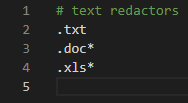

[< к содержанию](./readme.md)
# Файл .gitignore
Cуществуют файлы, которые нельзя добавлять в репозиторий. Это могут быть локальные настройки проекта, учётные данные, сведения об ошибках, библиотеки, промежуточные результаты компиляции и другие. Такие файлы требуется добавлять в игнорируемые для GIT.

Игнорируемые файлы — это, как правило, артефакты сборки и файлы, генерируемые машиной из исходных файлов в вашем репозитории, либо файлы, которые по какой-либо иной причине не должны попадать в коммиты.

Игнорируемые файлы отслеживаются в специальном файле **.gitignore**, который регистрируется в корневом каталоге репозитория. В Git нет специальной команды для указания игнорируемых файлов: вместо этого необходимо вручную отредактировать файл **.gitignore**, чтобы указать в нем новые файлы, которые должны быть проигнорированы.

---
## Основные правила синтаксиса этого файла:

1. Одна строчка — один шаблон.
2. Пустые строки игнорируются.
3. Чтобы написать комментарий, в начале строки укажите знак `#`.
4. Символ `/ `в начале строки указывает, что правило применяется *ТОЛЬКО* к файлам и каталогам, которые располагаются в том же каталоге, что и сам файл **.gitignore**.
5. Доступно использование спецсимволов:
   + Звёздочка `*` заменяет любое количество символов (в том числе и ноль). Например, правило `*.avi` будет игнорировать все файлы с расширением `.avi`;
   + Знак вопроса `?` заменяет любой 1 символ. Можно размещать в любом месте правила;
   + Две звёздочки `**` используются для указания любого количества подкаталогов. Например, `alex/**/account.txt `— будут игнорироваться все файлы в каталоге **alex* и во всех вложенных в него каталогах;
   + Восклицательный знак `!` в начале строки означает инвертирование правила;
   + Символ `\` используется для экранирования спецсимволов;
   + Символ `/` используется для разделения уровня каталогов.

   Пример файла **.gitgnore**:

   
---

[< Назад](./commands.md)

[Далее >](./remote.md)